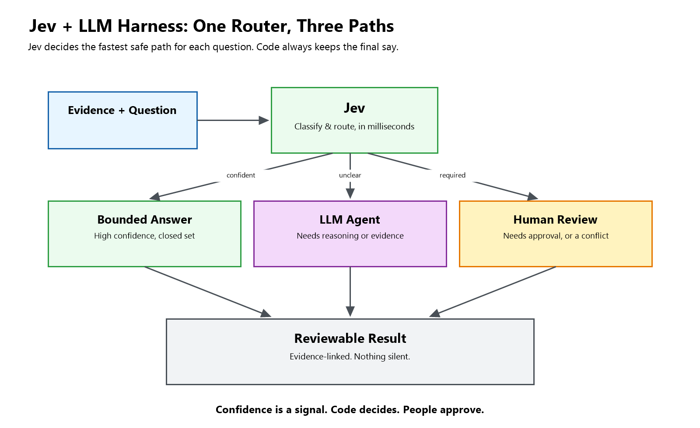

# Jev + LLM Harness (POC)

[](https://github.com/prarolab/jev-migration-harness)

A small reference implementation of a **cost-aware decision harness** that pairs
[Jev](https://docs.typesafe.ai/) (TypeSafe AI's typed, non-generative decision
model) with an LLM agent, orchestrated in [LangChain](https://www.langchain.com/).

**The core idea:** not every question needs an LLM. Some questions are bounded
classifications that a typed model can answer directly; others need real
reasoning, evidence synthesis, or a human decision. This harness routes each
question to the cheapest tool that can answer it correctly, and never lets a
model override a required approval.

The example workload used here is a **cloud migration assessment**
questionnaire (hundreds of yes/no, choice, and narrative questions asked about
an application before it moves to the cloud). That's just the test case — the
harness itself is domain-agnostic.

> **Status: proof of concept / reference code.** This is not a production
> service, not a benchmark, and not a claim that Jev is faster, cheaper, or
> more accurate than an LLM in general. See [Caveats](#caveats) below.

## Why this exists

Jev returns typed, probabilistic answers (`Noul`, `Choice`, `Score`) instead of
generated text.
That makes it a candidate for the many small, bounded decisions inside a larger
workflow, while an LLM agent stays responsible for open-ended analysis. This
repo is a working sketch of that split, built while exploring
[LangChain's "Building a Harness with Jev"](https://www.langchain.com/blog/building-a-harness-with-jev) post.

## Architecture



Design rules the code enforces:

- **Policy runs before any model call.** Questions marked `requires_owner`, or
  whose evidence is out of scope / stale, never reach Jev or the LLM.
- **Missing evidence is never "No."** Insufficient evidence is its own status.
- **Conflicting evidence always escalates to a human**, regardless of model confidence.
- **A high confidence score is a routing signal, not an approval.**
- **Every answer keeps its evidence references** so it can be reviewed, not just trusted.

## Project layout

```
models.py          Pydantic schemas: evidence, questions, Jev/LLM answer contracts
providers.py        LangChain Runnables: live HTTP adapters (Jev + OpenAI-compatible
                    chat) and offline DemoProviders fixtures for the bundled sample
harness.py          The prepare -> fan_out -> resolve LangChain (LCEL) pipeline
main.py             CLI entry point
sample_input.json   Fictional application + evidence + 5 representative questions
test_harness.py     unittest coverage (offline; mocks HTTP for the live adapters)
examples/           Pre-generated demo output (hybrid and LLM-only strategies)
```

## Quickstart (offline demo, no API keys needed)

```bash
python -m venv .venv
# Windows
.venv\Scripts\python.exe -m pip install -r requirements.txt
.venv\Scripts\python.exe main.py --mode demo

# macOS/Linux
.venv/bin/python -m pip install -r requirements.txt
.venv/bin/python main.py --mode demo
```

Demo mode uses fixed, fictional fixtures in `providers.py` — it never calls a
real API, and it only accepts the bundled `sample_input.json` (so the fixture
answers stay meaningful). Compare against the LLM-only baseline:

```bash
python main.py --mode demo --strategy llm-only
```

Pre-generated copies of both runs are in [`examples/`](./examples) if you just
want to read the output shape without running anything.

## Running tests

```bash
python -m unittest discover -v
```

20 tests cover routing/escalation logic, policy gates (owner approval, staleness,
environment scope), schema validation (citation grounding, probability
distributions, duplicate IDs), and HTTP contract behavior for the live adapters
via `httpx.MockTransport` — no network or credentials required.

## Live mode

Live mode calls the real TypeSafe and OpenAI-compatible endpoints. It requires
explicit opt-in and these **process environment variables** (never hardcode
keys in files):

```bash
export TYPESAFE_API_KEY=...      # required for --strategy hybrid
export OPENAI_API_KEY=...
export OPENAI_MODEL=...          # a model you have access to; not defaulted
export JEV_MODEL=jev-1.13.0      # optional, defaults to jev-1.13.0
```

```bash
python main.py --mode live --allow-external --output results/run-1.json
```

`--allow-external` is a deliberate second confirmation: it acknowledges that
your `state`/evidence will be sent to `api.typesafe.ai` and to your configured
OpenAI-compatible endpoint. Review and redact your input first if it contains
anything sensitive. There is no silent fallback between demo and live, and
provider errors (HTTP errors, refusals, truncated responses) fail the run
loudly rather than being swallowed or retried automatically.

Run the same evidence through the LLM-only baseline for comparison:

```bash
python main.py --mode live --strategy llm-only --allow-external --output results/baseline.json
```

## Using your own questions

`sample_input.json` follows the `AssessmentInput` schema in `models.py`:

- `evidence[]` — each item has an `id`, `source`, `environment`, `observed_at`
  date, and `content` string.
- `questions[]` — each has an `id`, `text`, `rubric`, `kind` (`choice` or
  `narrative`), `choices` (for `choice` questions), `evidence_ids` it may use,
  and optional `requires_owner` / `applicable` / `max_age_days`.

The harness only uses evidence that is (a) referenced by the question, (b)
in the same `environment` as the assessment, and (c) within `max_age_days` of
the assessment's `as_of` date. Everything else is treated as out of scope,
not silently included.

## Caveats

This code is deliberately conservative about what it claims:

- **No cost or accuracy numbers are asserted.** `metrics.actual_cost_usd` is
  always `null` — apply your own account pricing. Any cost comparison in
  accompanying write-ups is explicitly labeled hypothetical.
- **The `langchain-typesafe` and `langchain-openai` packages were not used**
  here (unavailable / a native-build issue in the environment this was built
  in). `providers.py` implements small `httpx`-based LangChain `Runnable`
  adapters directly against the documented HTTP APIs instead. Swap in the
  official packages if they're available in your environment.
- **The LLM fallback is a single bounded call over supplied evidence.** It is
  not (yet) a tool-using agent that retrieves new evidence on its own.
  Citations are checked for membership in the supplied evidence (exact
  substring match), not for semantic correctness.
- **Confidence thresholds (default `0.85`) are illustrative defaults**, not
  calibrated values. Tune and validate them against labeled data before
  relying on them.
- **This is not a security or compliance review tool.** Mandatory approvals
  (`requires_owner`) are enforced in code, but the overall harness does not
  grant any regulatory, security, or migration sign-off.

## References

- [TypeSafe AI docs](https://docs.typesafe.ai/)
- [Introduction to Jev — Aman Arora](https://amaarora.github.io/posts/2026-19-09-jev-intro.html)
- [Building a Harness with Jev — LangChain blog](https://www.langchain.com/blog/building-a-harness-with-jev)
- [LangChain TypeSafe integration docs](https://docs.langchain.com/oss/python/integrations/providers/typesafe)

## License

[MIT](./LICENSE) — see file for details. Update the copyright holder before publishing.
